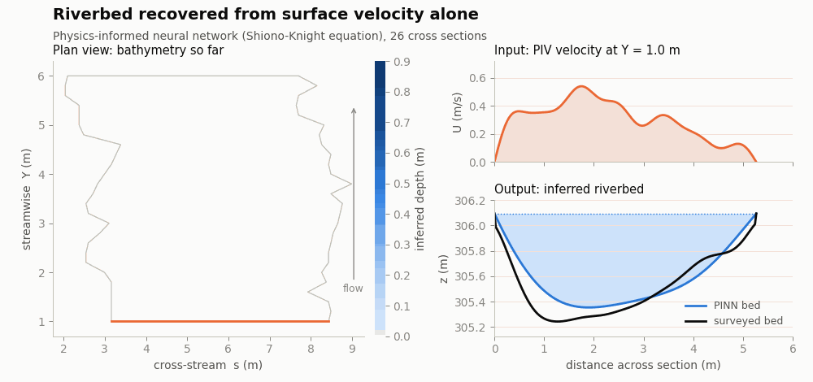

# Implicit river bathymetry

**Infer the shape of a riverbed from the motion of the water surface, by
training a neural network to obey the flow physics.**

*An orange scan line sweeps 26 cross sections. Measured surface velocity goes
in; the inferred riverbed fills in behind it. The right-hand panels show that
section's input velocity and output bed. The surveyed bed appears at the two
ends — the only places it was measured.*

## The problem

Knowing the shape of a riverbed matters for flood modelling, navigation and
habitat work, but measuring it means putting a boat with sonar on the water,
section by section. The water *surface*, by contrast, is easy to observe — from
a drone, from a camera on a bridge, from an existing hydraulic model.

Surface velocity and bed shape are linked by the flow physics. So rather than
survey the bed, solve for it: pose the depth as an unknown, and find the depth
profile whose implied flow reproduces the velocity that was actually observed.

## The approach

Depth along a cross section, `H(s)`, is represented by a small coordinate
network rather than a grid of values — the same implicit-representation idea as
the other projects here, applied to a river section instead of a seismic model.
The network is trained so that the flow it implies satisfies the depth-averaged
momentum balance (a Shiono–Knight-type lateral distribution model) while
matching the observed surface velocity.

Constraints enter as a ladder, and the ordering is the interesting part:

| constraint | what it pins down |
|---|---|
| physics only | shape, but not the overall scale |
| \+ total discharge | the scale |
| \+ a depth sounding or two | the remaining ambiguity |

Physics alone does not determine the bed. Adding the discharge fixes the
magnitude; a couple of point soundings remove what is left. That progression is
the core result, and it is why a handful of measurements can replace a full
survey.

## Validation

The method is checked three ways: against a HEC-RAS hydraulic model at surveyed
cross sections; across two different discharges, where the same bed must come
out of both; and across three independent velocity sources (HEC-RAS, PIV from
imagery, and FlowHatch), where the answer should not depend on which one is
used.

## Status

This is a **field-data application from work in preparation**. The animation
here was made for the web from published-format result CSVs. The manuscript
figures — the validation panels, the constraint ladder on real sections, the
uncertainty band — are held back until the paper is out, and will be added
then.

`code/make_gifs.py` renders the animation from the result CSVs. The CSVs
themselves are not in this repository.

## Context

Part of the SKM-PINN work at the NDSU ICE Lab on the Buffalo River, North
Dakota. Companion projects using the same implicit-representation idea for
seismic inversion:

- [implicit-elastic-fwi](https://github.com/anhle156/implicit-elastic-fwi) — elastic full-waveform inversion from a random start
- [implicit-acoustic-fwi](https://github.com/anhle156/implicit-acoustic-fwi) — the acoustic predecessor

---

Anh Le · [github.com/anhle156](https://github.com/anhle156)
